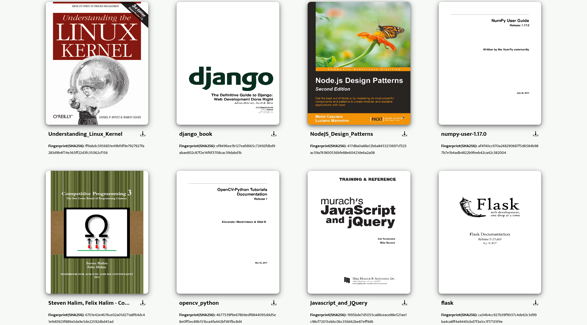

# PDFShare
PDFShare is a single-page application for PDF viewing, downloading, and local distributing.
Once setup, it enables one to move around and store their PDFs.

## **Website**

PDFShare consists of a single infinite-scroll styled view which displays the PDFs. For 
each PDF, it is possible to see the name of the PDF, an option to download it, and a 
SHA256 checksum to validate its integrity.

## **Configuration**
To setup PDFShare, it is important that the following files have been properly configured:
- The `config.py` file for PDFShare backend.
- The `.env` file for Vue.
- The `.env` file for Docker.

### **PDFShare Backend**
The `config.py` file under `/backend/pdfshare/app` stores configuration details and 
constants used for the backend. Settings inside of `config.py` include:
- **BOOKS_DIR_SYSTEM=** path where PDFs are stored.
- **COVERS_DIR_SYSTEM=** path where PDF png covers are stored.
- **PORT=** port of flask server. *Note changing this will necessitates changes to   
  gunicorn_config.py, Dockerfile, and docker-compose.yml files*.
- **MONGO_HOST=** host of the MongoDB server that storages the book metadata.
- **MONGO_PORT=** port of the MongoDB server that storages the book metadata.

### **VueJS Env**
The `.env` needs to be created by copying the contents of `.env.template`, which
can be found inside of `/frontend`, into it. Settings inside of `.env` include:
- **VUE_APP_BASE_URL=** base url of the PDFShare backend. For example, assuming the
  the `PORT` within `config.py` is set to 9000 and the host machine has the ip address
  of `10.0.1.11`, then this variable should be set to `http://10.0.1.11:9000`.

### **Docker Env**
The `.env` needs to be created by copying the contents of `.env.template`, which
can be found inside of `/`, into it. Settings inside of `.env` include:
- **PDF_DIR=** path where PDFs are stored. Should be the same as the `BOOKS_DIR_SYSTEM`
  variable inside of `config.py`.

## **PDF Book Scanner Daemon(pdfbsd)**
As an optimization over having book cover generation done during a user request (which
led to slow page renders during such events), the logic was instead moved into a daemon
process that listens to filesystem events against the Books directory. To simplify IPC
between PDFShare and pdfbsd, MongoDB was used. This way, when pdfbsd discovers a new
unique book, its saves the metadata as a record in the mappings collection under books
db from which PDFShare then reads to determine which books exist. This change ensures
that requests times are consist across all edge cases.

## **Installation**
To install and run PDFShare, is is important that Docker and Docker Compose are installed
on the system. Likewise, it is assumed that NodeJS is also present on the system.

### **With Docker**
1. Clone the repo and setup all of the config as [required](#configuration).
2. Go into `/frontend` and build Vue.js frontend by running `npm run build`.
3. Build Docker containers `docker-compose build`
4. Start PDFShare with `docker-compose up -d`.

## **Adding Books During Runtime**
Nothing special needs to be done when adding books while PDFShare is running. Simply place
the PDF in the required directory depending on the installation format. From there, pdfbsd
will generate a cover for this book and the book should appear once the site is refreshed.