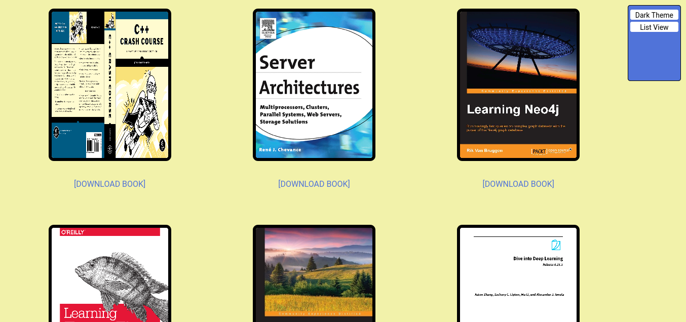
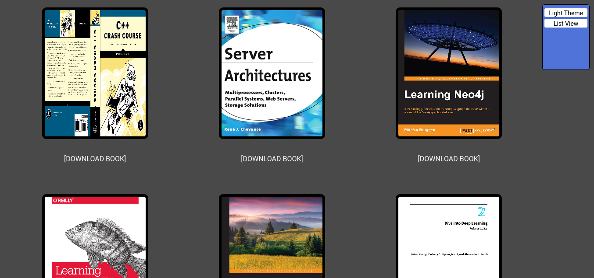

# PDFShare

#### PDFShare is a simple online pdf viewing, downloading, and distrubuting website. Once setup, it enables one to move around and store their PDFs and avoid the need for cloud storage and/or email as would be done otherwise.

## **Website**
PDFShare is relatively simple to avoid unneeded strain on system resources and to expand compatability to older devices. The site consists of two views called gallery and list view, with the former allowing one to view the covers of the PDFs and the latter provides a simple view to download a PDF quickly.  

### **Gallery View**

Accessible under `<hostname>/` or `<hostname>/library/gallery-view`, the gallery view allows one to view their PDFs visually via the covers of the PDFs. Clicking the cover will open the PDF up in the browser's built-in PDF viewer if the browser supports such functionality. 

### **List View**

Accessible under `<hostname>/library/list-view`, list view gives a continuous list of all the names of the PDFs. Clicking any of the links behind the PDF will prompt the user with the download request to download the PDF onto the local machine.

### **Dark Mode**
PDFShare supports a persistent dark mode option by saving the user's choice as a local storage flag. It is possible to toggle dark mode site-wide using the config box in the top right corner of the screen.

#### Gallery view in dark mode

#### List view in dark mode

## **Configuration**
The `config.py` file under `/pdfshare/app` stores global configuration details and constants used throughout the program. Settings in the `config.py` file include:
- **BOOKS_DIR_SYSTEM=** path where PDFs are stored.
- **COVERS_DIR_SYSTEM=** path where PDF png covers are stored.
- **DEFAULT_COVER_FILE=** default cover photo is error arised and one cannot be genereted.
- **PORT=** port of flask server. *Note changing this will necessitates changes to gunicorn_config.py, Dockerfile, and docker-compose.yml files*
- **BOOKS_PER_ROW=** number of books for row when in gallery view. Must be between [1,3].
- **MONGO_HOST=** the host of the MongoDB server that storages the book metadata.
- **MONGO_PORT=** the port of the MongoDB server that storages the book metadata.

## **PDF Book Scanner Daemon(pdfbsd)**
As an optimization over having book cover generation done during a user request (which led to slow page renders during such events), the logic was instead moved into a daemon process that listens to filesystem events against the Books directory. To simplfy IPC between PDFShare and pdfbsd, MongoDB was used. This way, when pdfbsd discovers a new unique book, its saves the metadata as a record in the mappings collection under books db from which PDFShare then reads to determine which books exist. This change ensures that requests times are consist across all edge cases.

## **Installation**
*Note installation assumes apt package manager is pre-installed. Modify as needed for other package managers.*

### **Without Docker**
1. Run `apt-get install poppler-utils gunicorn python3` .
2. Install python packages with `pip3 install -r requirements.txt`.
3. Install and setup MongoDB. Set the host and port info for this server in `config.py`.
4. From the root directory of the project, run `python3 -m pdfshare.pdfbsd.pdfbsd` to launch pdfbsd. Then, to launch the
    website/PDFShare run `python3 -m   pdfshare.app.main`. *Note: running* `run_pdfbsd_pdfshare.sh` *script is equivalent to running the two previous
    commands*.
5. Place all PDFs in the directory that was specified in `config.py`.
6. (Optional). Run PDFShare over a WSGI via gunicorn with  `gunicorn -c gunicorn_config.py wsgi:app`. 

### **With Docker**
1. Create directory which is where the PDFs will live. Then, copy the template file `.env.template` and save it as `.env`. Set the `BOOKS_DIR` 
   environment variable to the directory where the books live.
2. Build containers `docker-compose build`
3. Start PDFShare with `docker-compose up -d`.

## **Adding Books During Runtime**
Nothing special needs to be done when adding books while PDFShare is running. Simply place the PDF in the required directory dependending on the installation format. From there, pdfbsd will generate a cover for this book and the book should appear once the site is refreshed.